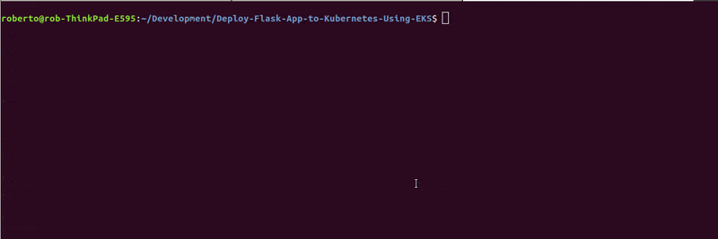
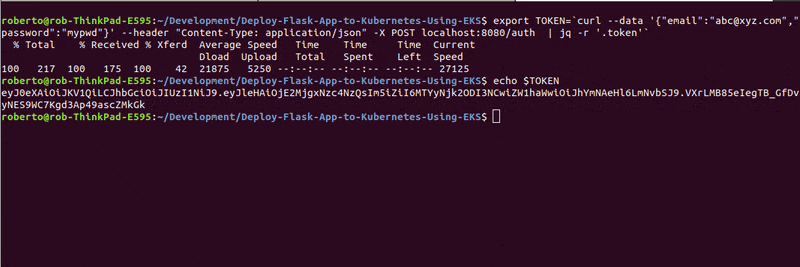

# Deploying a containerized Flask API on Amazon Elastic Kubernetes Service (Amazon EKS)


This project shows how to containerize and deploy a Flask API to a Kubernetes cluster using Docker, AWS EKS, CodePipeline, and CodeBuild.

The Flask app used for this project consists of a simple API with three endpoints:

- `GET '/'`: This is a simple health check, which returns the response 'Healthy'. 
- `POST '/auth'`: This takes a email and password as json arguments and returns a JWT based on a custom secret.
- `GET '/contents'`: This requires a valid JWT, and returns the un-encrpyted contents of that token. 

The app relies on a secret set as the environment variable `JWT_SECRET` to produce a JWT. 

## Dependencies

- Python 3.6 or higher. Check the current version using: `python --version`  
- Docker Engine
    - Installation instructions for all OSes can be found [here](https://docs.docker.com/install/).
 - AWS Account
     - You can create an AWS account by signing up [here](https://aws.amazon.com/#).

## Initial setup
1. Locally clone this project to begin working on the project  
2. Create a new virtual environment and activate it  
3. Install python dependencies `pip install -r requirements.txt`   
4. Set environment variables  

You do need the following two variables available in your terminal environment:

JWT_SECRET - The secret used to make the JWT, for the purpose of this project the secret can be any string.
LOG_LEVEL - It represents the level of logging. It is optional to be set. It has a default value as 'INFO', but when debugging an app locally, you may want to set it to 'DEBUG'.

To add these to your terminal environment, run the following:

```
 export JWT_SECRET='myjwtsecret'
 export LOG_LEVEL=DEBUG
```
Verify:
```
echo $JWT_SECRET
echo $LOG_LEVEL
```

5.  **Run the app locally**
    Run the app locally using the Flask server. From the root directory of the downloaded repository, run:

    ```
    python main.py
    ```
    Check the endpoints:  
    <pre>
    curl --request GET 'http://localhost:8080/'
    </pre>

    To try the `/auth` endpoint, use the following command, replacing email/password as applicable to you:

    ```
    export TOKEN=`curl --data '{"email":"abc@xyz.com","password":"mypwd"}' --header "Content-Type: application/json" -X POST localhost:8080/auth  | jq -r '.token'`

    ```

    This calls the endpoint 'localhost:8080/auth' with the email/password as the message body. The return value is a JWT token based on the secret string you supplied. We are assigning that secret to the environment variable 'TOKEN'. To see the JWT token, run:

    ```
     echo $TOKEN

    ```

     

    To try the `/contents` endpoint which decrypts the token and returns its content, run:

    ```
     curl --request GET 'http://localhost:8080/contents' -H "Authorization: Bearer ${TOKEN}" | jq .

    ```

    You should see the email id that you passed in as one of the values.

     

6. **Run the app locally in a container**

    Use a container for testing locally the app in an environment that is similar to the production environment. 
    To build a Docker image on your machine out of the provided 'Dockerfile' go to the apps root directory, which is where the `Dockerfile` is located. Build the Docker image using the docker build command:  
    <pre>
    docker build --tag myImageTest .
    </pre>
    Here, we name (tag) this image with the friendly name "test", you may use one of your choosing.    

    Running <code>docker image ls</code> will show your image with the name you’ve chosen.  

    To pass many environment variables to a Docker continer in one batch you'll need to create a file named <code>.env_file</code> and save both JWT_SECRET and LOG_LEVEL into <code>.env_file</code> (without the prepended 'export' command). These environment variables should only be stored locally. Do not push them into the Github or other public repositories. To prevent accidentally checking in the secret files unintentionally <code>.env_file</code> was added to .gitignore.  
    
    Here is an exemplary <code>.env_file</code> file:  

    <pre>
    JWT_SECRET='myjwtsecret'
    LOG_LEVEL=DEBUG
    </pre>

    Run and connect to the container (--rm option ensures that the container is removed when it exits):  
    <pre>
    docker run --rm --name myContainer --env-file=.env_file -p 80:8080 myImageTest
    </pre>
    The line above exposes the port 8080 of the container to port 80 on your host machine.  

    Check the endpoints  
    To use the endpoints, you can use the same <code>curl</code> commands as before, except using port 80 this time. Open a new terminal window, and try the following command:
    <pre>
    curl --request GET 'http://localhost:80/'
    </pre>
    You should see "Healthy" as response.  

    For other two endpoints, try running the following commands. The first calls the endpoint 'localhost:80/auth' with the email/password as the message body. The return JWT token assigned to the environment variable 'TOKEN':
    <pre>
    export TOKEN=`curl --data '{"email":"abc@xyz.com","password":"WindowsPwd"}' --header "Content-Type: application/json" -X POST localhost:80/auth  | jq -r '.token'`
    echo $TOKEN
    </pre>
    To decrypt the token and return its content, run:  
    <pre>
    curl --request GET 'http://localhost:80/contents' -H "Authorization: Bearer ${TOKEN}" | jq .
    </pre>

    Use the <code>docker ps -a</code> command to show you the containers on your Docker host.   
    Stop a container with <code>docker stop &lt;container_ID&gt;<code>   
    Remove it with <code>docker container rm &lt;container_ID&gt;<code>  
    Remove any Docker image with <code>docker image rm &lt;image_id&gt;<code>

## Acknowledgement  

This project is based on the following repository:   

```
https://github.com/udacity/FSND-Deploy-Flask-App-to-Kubernetes-Using-EKS
```
